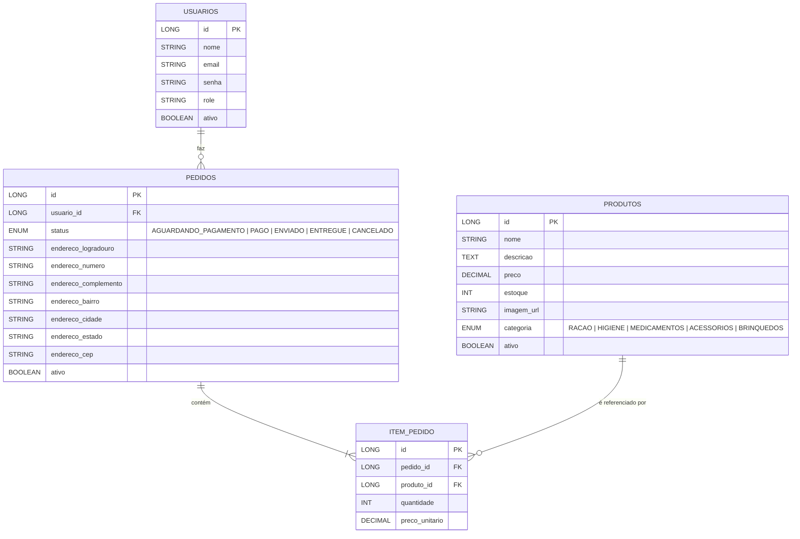
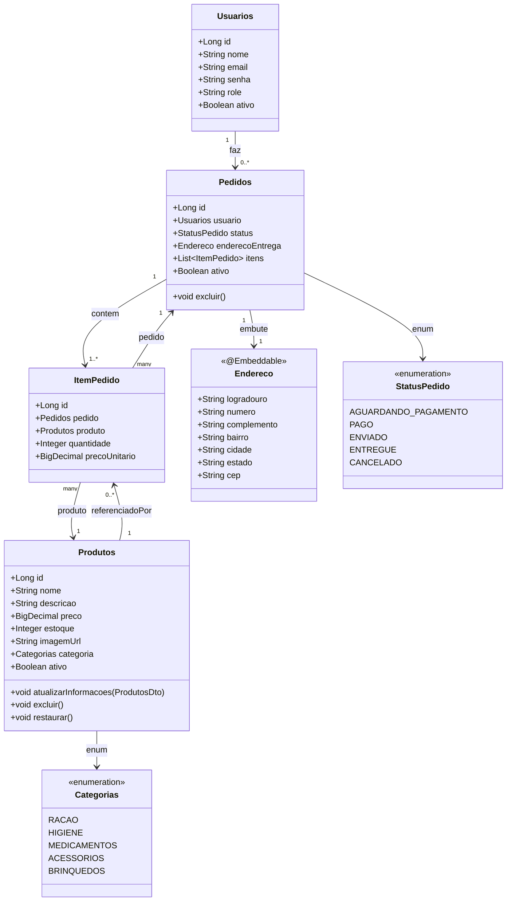

# Dompet API — E-commerce (Spring Boot)

> Backend para e-commerce, com **estrutura por feature**, **JWT**, **H2**, **Swagger** e exemplos de **seed**

## ⚙️ Stack
- **Java 21**, **Spring Boot 3.5**
- Spring Web, Spring Data JPA, H2
- Spring Security + **JWT (jjwt)**
- Bean Validation (Jakarta)
- Lombok
- Swagger / OpenAPI

---

## 📁 Estrutura (feature‑first)

```
com.dompet.api
├─ common/
│  ├─ config/                 # Security, Swagger, CORS, Jackson, etc.
│  └─ exception/              # Handler global
├─ shared/
│  └─ endereco/Endereco.java  # @Embeddable reutilizado
└─ features/
   ├─ auth/                   # DTOs, controller, filtro JWT, TokenService
   ├─ produtos/               # domain, dto, repo, web
   ├─ pedidos/                # domain (Pedido, ItemPedido), repo, web
   └─ usuarios/               # domain, repo, web
```

> Mantemos cada **feature** com: `domain/`, `dto/`, `repo/`, `service/ (opcional)`, `web/`.

---

## 🔐 Autenticação (JWT)

### Dependências (pom.xml)
```xml
<dependency>
  <groupId>org.springframework.boot</groupId>
  <artifactId>spring-boot-starter-security</artifactId>
</dependency>
<dependency>
  <groupId>io.jsonwebtoken</groupId>
  <artifactId>jjwt-api</artifactId>
  <version>0.11.5</version>
</dependency>
<dependency>
  <groupId>io.jsonwebtoken</groupId>
  <artifactId>jjwt-impl</artifactId>
  <version>0.11.5</version>
  <scope>runtime</scope>
</dependency>
<dependency>
  <groupId>io.jsonwebtoken</groupId>
  <artifactId>jjwt-jackson</artifactId>
  <version>0.11.5</version>
  <scope>runtime</scope>
</dependency>
```

### Propriedades
```properties
# JWT
app.jwt.secret=COLA_AQUI_UMA_CHAVE_BASE64_DE_32_BYTES
app.jwt.expiration=1h

# H2 (dev)
spring.h2.console.enabled=true
spring.jpa.hibernate.ddl-auto=update
```

**Gerar chave** (32 bytes Base64 / HS256):
- **Windows (PowerShell):**
  ```powershell
  [Convert]::ToBase64String([System.Security.Cryptography.RandomNumberGenerator]::GetBytes(32))
  ```
- **Linux/macOS (OpenSSL):**
  ```bash
  openssl rand -base64 32
  ```

> No código, a senha do usuário é **hasheada** com BCrypt e **não** é reversível.

---

## 🗃️ Modelo de domínio

### ER diagram


### Class diagram (JPA + enums + embutidos)


---

## 🚀 Como rodar

### Pré‑requisitos
- Java 21, Maven
- (Dev) H2 Console: `http://localhost:8080/h2-console` (JDBC URL: `jdbc:h2:mem:dompet`)

## 📖 Swagger / OpenAPI
- **UI**: `http://localhost:8080/swagger-ui.html`
- **Docs**: `http://localhost:8080/v3/api-docs`


---

## 🌱 Seed (data.sql)

### Usuários (BCrypt entre parênteses a senha para teste)
```sql
-- ADMIN (senha: Admin@123)
INSERT INTO usuarios (nome, email, senha, role, ativo) VALUES
('Admin', 'admin@dompet.dev', '$2b$10$E.iUyby25SywbG1jyoHM7uoIDs6mhFnIPDkyTg.4g9Ove6gCp3/py', 'ADMIN', TRUE);

-- RODRIGO (senha: 123456)
INSERT INTO usuarios (nome, email, senha, role, ativo) VALUES
('Rodrigo', 'rodrigo@dompet.dev', '$2b$10$7m9nB.s8kppeEhvJ9z/wFuK1eMzH5NIo4TqI1g9XJ/CKLmeILJEvq', 'USER', TRUE);

-- JÚLIA (senha: 123456)
INSERT INTO usuarios (nome, email, senha, role, ativo) VALUES
('Júlia', 'julia@dompet.dev', '$2b$10$cZ3D8Ou65Ps/ryh0tV28fu/0g57FruZhZwp4AnIizLNusjfqCQJEm', 'USER', TRUE);

-- CARLOS (senha: cliente123)
INSERT INTO usuarios (nome, email, senha, role, ativo) VALUES
('Carlos', 'carlos@dompet.dev', '$2b$10$IOalqC2na454mb7tay7EJei9McMbEkGYfoeyDm.bpuKZPKEEZH5fe', 'USER', TRUE);

-- MARIA (senha: cliente123)
INSERT INTO usuarios (nome, email, senha, role, ativo) VALUES
('Maria', 'maria@dompet.dev', '$2b$10$Z.BIOEnOYI3bfXtSeTcOtOQIZItTSv24GaP2HR69evFdSVwmUIwDi', 'USER', TRUE);
```

> Você pode adicionar um bloco de produtos conforme sua `entity Produtos` (preço como **BigDecimal**).

---

## 🔌 Endpoints (resumo)

### Auth
- `POST /auth/register` → cria usuário e retorna **JWT**
  ```json
  { "nome":"Rodrigo", "email":"rodrigo@dompet.dev", "senha":"123456" }
  ```
- `POST /auth/login` → retorna **JWT**
  ```json
  { "email":"rodrigo@dompet.dev", "senha":"123456" }
  ```

### Produtos
- `GET /produtos` — público; filtros opcionais:
  - `?categoria=RACAO`
  - `?nome=golden`
- `GET /produtos/{id}` — público
- `POST /produtos` — **autenticado** (envie `Authorization: Bearer <token>`)
- `PUT /produtos/{id}` — autenticado
- `DELETE /produtos/{id}` — autenticado (soft delete `ativo=false`)
- `PATCH /produtos/{id}/ativar` — autenticado (undo do soft delete)

**Exemplo de criação:**
```json
{
  "nome": "Ração Golden",
  "descricao": "Ração premium para cães adultos",
  "preco": 129.90,
  "estoque": 15,
  "imagemUrl": "https://meuecommerce.com/imagens/racao.png",
  "ativo": true,
  "categoria": "RACAO"
}
```

### Pedidos / Carrinho (quando implementar)
- `POST /carrinho/add`, `PATCH /carrinho/update`, `POST /checkout` …


### Insomnia/Postman
1. **POST** `/auth/register` ou **/auth/login** → copie `token` do JSON  
2. Nas requests protegidas, use **Bearer Token** com o JWT.

---

## ✅ Boas práticas já aplicadas
- `BigDecimal` para preços (`@Column(precision=10, scale=2)`)
- Soft delete (`ativo=true/false`) + endpoints de **ativar/excluir**
- DTOs com validação (@NotBlank/@NotNull/@PositiveOrZero)
- Enum `Categorias` persistido como `STRING`
- Filtro JWT `OncePerRequestFilter` + Security stateless
- Erros de validação tratáveis com `@RestControllerAdvice` (sugestão)

---

## 🗺️ A ser implementado
- Carrinho + Checkout


---

## 📄 Licença
Livre para estudo e evolução. ✨
