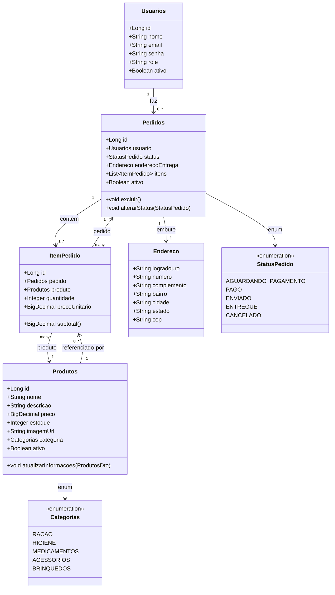

```mermaid
erDiagram
  USUARIOS ||--o{ PEDIDOS : "faz"
  PEDIDOS  ||--|{ ITEM_PEDIDO : "contém"
  PRODUTOS ||--o{ ITEM_PEDIDO : "referenciado por"

  USUARIOS {
    LONG id PK
    STRING nome
    STRING email
    STRING senha
    STRING role
    BOOLEAN ativo
  }

  PRODUTOS {
    LONG id PK
    STRING nome
    TEXT  descricao
    DECIMAL(10,2) preco
    INT   estoque
    STRING imagem_url
    ENUM  categoria   "RACAO | HIGIENE | MEDICAMENTOS | ACESSORIOS | BRINQUEDOS"
    BOOLEAN ativo
  }

  PEDIDOS {
    LONG id PK
    LONG usuario_id FK
    ENUM status      "AGUARDANDO_PAGAMENTO | PAGO | ENVIADO | ENTREGUE | CANCELADO"
    -- Endereco embutido (campos abaixo)
    STRING endereco_logradouro
    STRING endereco_numero
    STRING endereco_complemento
    STRING endereco_bairro
    STRING endereco_cidade
    STRING endereco_estado
    STRING endereco_cep
    BOOLEAN ativo
  }

  ITEM_PEDIDO {
    LONG id PK
    LONG pedido_id FK
    LONG produto_id FK
    INT  quantidade
    DECIMAL(10,2) preco_unitario
    -- subtotal é calculado
  }
```

### Classes (JPA/domínio)

