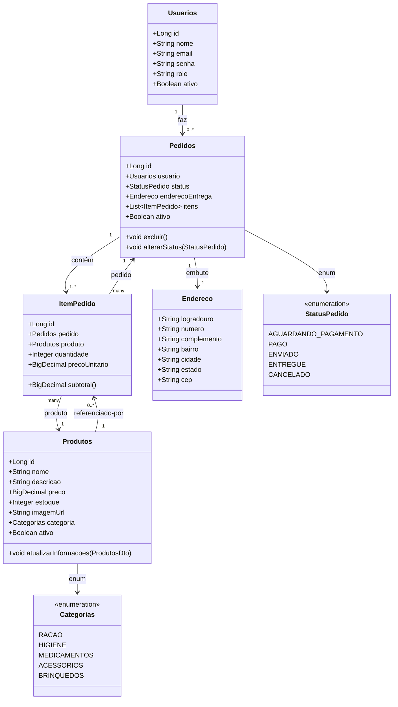

```mermaid
erDiagram
  USUARIOS ||--o{ PEDIDOS : "faz"
  PEDIDOS  ||--|{ ITEM_PEDIDO : "contém"
  PRODUTOS ||--o{ ITEM_PEDIDO : "referenciado por"

  USUARIOS {
    int id PK
    string nome
    string email
    string senha
    string role
    boolean ativo
  }

  PRODUTOS {
    int id PK
    string nome
    string descricao
    float  preco          %% BigDecimal/DECIMAL(10,2) no banco
    int    estoque
    string imagem_url
    string categoria      %% enum no código
    boolean ativo
  }

  PEDIDOS {
    int id PK
    int usuario_id FK
    string status         %% enum no código
    string endereco_logradouro
    string endereco_numero
    string endereco_complemento
    string endereco_bairro
    string endereco_cidade
    string endereco_estado
    string endereco_cep
    boolean ativo
  }

  ITEM_PEDIDO {
    int id PK
    int pedido_id FK
    int produto_id FK
    int quantidade
    float preco_unitario  %% BigDecimal/DECIMAL(10,2) no banco
  }
```

### Classes (JPA/domínio)

