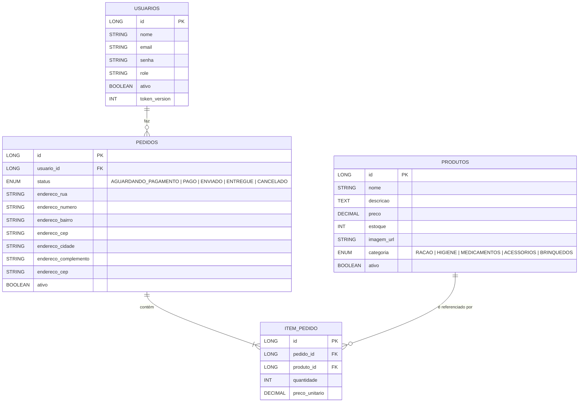
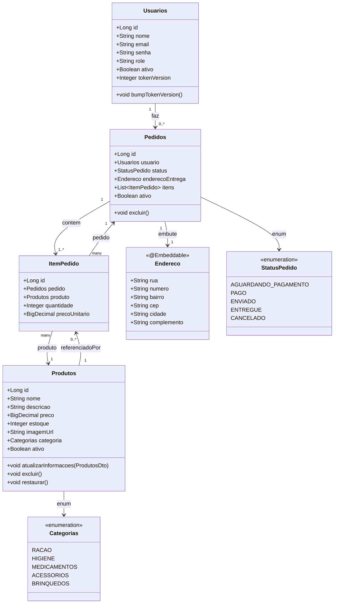
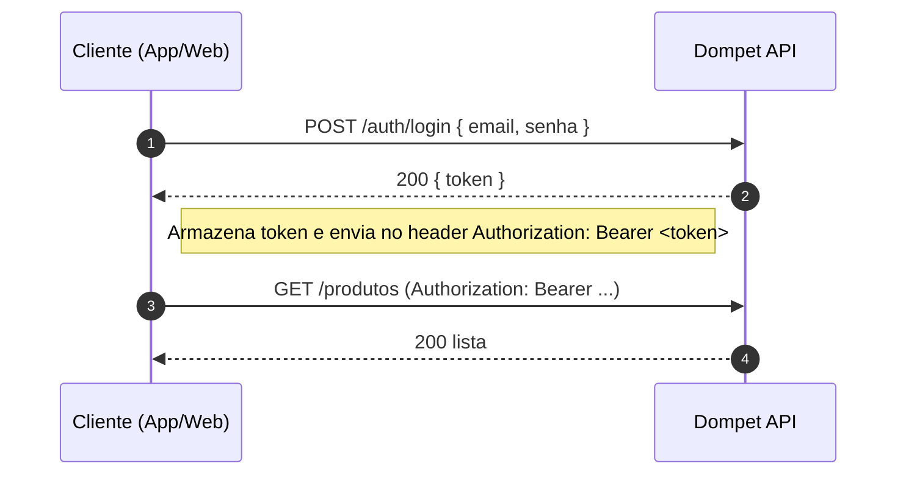

# Dompet API — E-commerce (Spring Boot)

> Backend para e-commerce com **estrutura por feature**, **JWT**, **H2**, **Swagger** e exemplos de **seed**

## ⚙️ Stack
- **Java 21**, **Spring Boot 3.5**
- Spring Web, Spring Data JPA, H2
- Spring Security + **JWT (jjwt)**
- Bean Validation (Jakarta)
- Lombok
- Swagger / OpenAPI
- PostgreSQL 17
---

## 🔗 Links rápidos

- Swagger UI: http://localhost:8080/swagger-ui.html (ou /swagger-ui/index.html)
- OpenAPI JSON: http://localhost:8080/v3/api-docs

---

## 📁 Estrutura (feature‑first)

```
com.dompet.api
├─ common/
│  ├─ config/                 # Security, Swagger, CORS, Jackson, etc.
│  └─ errors/                 # Exceptions + handler global
├─ shared/
│  └─ endereco/Endereco.java  # @Embeddable reutilizado
└─ features/
   ├─ auth/                   # DTOs, controller, filtro JWT, TokenService
   ├─ produtos/               # domain, dto, repo, web
   ├─ carrinho/               # domain (Carrinho, ItemCarrinho), dto, repo, service, web
   ├─ pedidos/                # domain (Pedido, ItemPedido), dto, repo, service, web
   └─ usuarios/               # domain, repo, web
```

> Mantemos cada **feature** com: `domain/`, `dto/`, `repo/`, `service/ (opcional)`, `web/`.

---

## 🔐 Autenticação (JWT)

### Dependências (pom.xml)
```xml
<dependency>
  <groupId>org.springframework.boot</groupId>
  <artifactId>spring-boot-starter-security</artifactId>
</dependency>
<dependency>
  <groupId>io.jsonwebtoken</groupId>
  <artifactId>jjwt-api</artifactId>
  <version>0.11.5</version>
</dependency>
<dependency>
  <groupId>io.jsonwebtoken</groupId>
  <artifactId>jjwt-impl</artifactId>
  <version>0.11.5</version>
  <scope>runtime</scope>
</dependency>
<dependency>
  <groupId>io.jsonwebtoken</groupId>
  <artifactId>jjwt-jackson</artifactId>
  <version>0.11.5</version>
  <scope>runtime</scope>
</dependency>
```

### Propriedades
```properties
# JWT
app.jwt.secret=COLA_AQUI_UMA_CHAVE_BASE64_DE_32_BYTES
app.jwt.expiration-ms=3600000  # 1h

# H2 (dev)
spring.h2.console.enabled=true
spring.jpa.hibernate.ddl-auto=update
spring.jpa.defer-datasource-initialization=true
spring.sql.init.mode=always
```


> No código, a senha do usuário é **hasheada** com BCrypt e **não** é reversível.

---

## 🗃️ Modelo de domínio

### ER diagram


### Class diagram (JPA + enums + embutidos)


---

## 🚀 Como rodar

### Pré‑requisitos
- Java 21, Maven
- (Dev) H2 Console: `http://localhost:8080/h2-console` (JDBC URL: `jdbc:h2:mem:dompet`)

### Iniciar a API (Windows/PowerShell)
- Via Maven Wrapper (sem Maven instalado):
  ```powershell
  .\mvnw.cmd spring-boot:run
  ```
- Ou gerando o jar:
  ```powershell
  .\mvnw.cmd -q -DskipTests package
  java -jar .\target\api-*.jar
  ```

## 📖 Swagger / OpenAPI
- UI: `http://localhost:8080/swagger-ui.html`
- Docs: `http://localhost:8080/v3/api-docs`

Como autorizar no Swagger UI:
1. Faça login em `POST /auth/login` com seu email/senha.
2. Copie o `token` retornado.
3. Clique em Authorize (cadeado) no topo da UI e cole como `Bearer <token>`.

Notas de contrato recentes:
- Produtos inclui `sku` no `ProdutosReadDto`.
- `GET /produtos/{id}` expõe cabeçalho `ETag` e suporta `If-None-Match` retornando `304 Not Modified`.
- Mutations de produtos e pedidos exigem `bearerAuth` e perfis adequados (ADMIN quando indicado).

Exemplos rápidos (PowerShell):
```powershell
# Login
$resp = Invoke-RestMethod -Method Post -Uri http://localhost:8080/auth/login -ContentType 'application/json' -Body '{"email":"admin@dompet.dev","senha":"Admin@123"}'
$token = $resp.token

# Buscar produto por ID com ETag
$r1 = Invoke-WebRequest -Headers @{ Authorization = "Bearer $token" } -Uri http://localhost:8080/produtos/1
$etag = $r1.Headers.ETag

# Conditional GET retorna 304
Invoke-WebRequest -Headers @{ Authorization = "Bearer $token"; 'If-None-Match' = $etag } -Uri http://localhost:8080/produtos/1 -ErrorAction SilentlyContinue
```


---

## 🌱 Seed (data.sql)

### Usuários (BCrypt entre parênteses a senha para teste)
```sql
-- ADMIN (senha: Admin@123)
INSERT INTO usuarios (nome, email, senha, role, ativo) VALUES
('Admin', 'admin@dompet.dev', '$2b$10$E.iUyby25SywbG1jyoHM7uoIDs6mhFnIPDkyTg.4g9Ove6gCp3/py', 'ADMIN', TRUE);

-- RODRIGO (senha: 123456)
INSERT INTO usuarios (nome, email, senha, role, ativo) VALUES
('Rodrigo', 'rodrigo@dompet.dev', '$2b$10$7m9nB.s8kppeEhvJ9z/wFuK1eMzH5NIo4TqI1g9XJ/CKLmeILJEvq', 'USER', TRUE);

-- JÚLIA (senha: 123456)
INSERT INTO usuarios (nome, email, senha, role, ativo) VALUES
('Júlia', 'julia@dompet.dev', '$2b$10$cZ3D8Ou65Ps/ryh0tV28fu/0g57FruZhZwp4AnIizLNusjfqCQJEm', 'USER', TRUE);

-- CARLOS (senha: cliente123)
INSERT INTO usuarios (nome, email, senha, role, ativo) VALUES
('Carlos', 'carlos@dompet.dev', '$2b$10$IOalqC2na454mb7tay7EJei9McMbEkGYfoeyDm.bpuKZPKEEZH5fe', 'USER', TRUE);

-- MARIA (senha: cliente123)
INSERT INTO usuarios (nome, email, senha, role, ativo) VALUES
('Maria', 'maria@dompet.dev', '$2b$10$Z.BIOEnOYI3bfXtSeTcOtOQIZItTSv24GaP2HR69evFdSVwmUIwDi', 'USER', TRUE);
```

> Você pode adicionar um bloco de produtos conforme sua `entity Produtos` (preço como **BigDecimal**).

---

## 🔌 Endpoints (resumo)

### Auth
- `POST /auth/register` → cria usuário e retorna **JWT**
  ```json
  { "nome":"Rodrigo", "email":"rodrigo@dompet.dev", "senha":"123456" }
  ```
- `POST /auth/login` → retorna **JWT**
  ```json
  { "email":"rodrigo@dompet.dev", "senha":"123456" }
  ```
- `POST /auth/logout` → 204 No Content (stateless). Cliente deve descartar o token.
- `POST /auth/logout-all` → 204; incrementa tokenVersion. Tokens antigos passam a 401.

### Produtos
- `GET /produtos` — público; filtros opcionais:
  - `?categoria=RACAO`
  - `?nome=golden`
  - Para paginação sem quebrar compat: use `GET /produtos/search?page=0&size=12&sort=preco,asc&nome=golden&categoria=RACAO`
- `GET /produtos/{id}` — público
- `GET /produtos/categorias` — público; enum de categorias disponíveis
- `POST /produtos` — **ADMIN** (envie `Authorization: Bearer <token>`)
- `PUT /produtos/{id}` — **ADMIN**
- `DELETE /produtos/{id}` — **ADMIN** (soft delete `ativo=false`)

**Exemplo de criação:**
```json
{
  "nome": "Ração Golden",
  "descricao": "Ração premium para cães adultos",
  "preco": 129.90,
  "estoque": 15,
  "imagemUrl": "https://meuecommerce.com/imagens/racao.png",
  "ativo": true,
  "categoria": "RACAO"
}
```

### Carrinho
- Todas exigem Authorization: Bearer <token>
- `GET /cart` — retorna o carrinho atual (ABERTO) do usuário
- `POST /cart/items` — adiciona/mescla item
  ```json
  { "produtoId": 1, "quantidade": 2 }
  ```
- `PATCH /cart/items/{itemId}` — atualiza quantidade (0 remove)
  ```json
  { "quantidade": 3 }
  ```
- `DELETE /cart/items/{itemId}` — remove item
- `DELETE /cart` — limpa carrinho

Observações:
- Use o `id` retornado em `GET /cart` como `{carrinhoId}`.
- Regras: `delta != 0`, não decrementar item inexistente, resultado não pode ser negativo nem exceder estoque; resultado 0 remove o item.

### Pedidos
- `POST /pedidos/checkout` — cria pedido a partir do carrinho e zera o carrinho
  ```json
  {
    "enderecoEntrega": {
  "rua": "Rua A",
      "numero": "100",
      "bairro": "Centro",
  "cep": "01000-000",
      "cidade": "SP",
  "complemento": "ap 12"
    },
    "observacoes": "Entregar à tarde",
    "metodoPagamento": "CARTAO"
  }
  ```
- `GET /pedidos` — lista meus pedidos (paginado)
- `GET /pedidos/{id}` — detalhe (dono ou ADMIN)
- `PATCH /pedidos/{id}/status` — ADMIN (ex.: `PAGO`, `ENVIADO`, `ENTREGUE`, `CANCELADO`)

### Insomnia/Postman
1. **POST** `/auth/register` ou `/auth/login` → copie `token` do JSON
2. **GET** `/produtos` (público)
3. **POST** `/cart/items` (com Bearer)
4. **GET** `/cart`
5. **POST** `/pedidos/checkout`
6. **GET** `/pedidos`

Coleção pronta (import): `docs/Insomnia_DomPet_API.json`.

---

## Erros (ProblemDetail)
- Formato: `application/problem+json`
- Campos: `type?`, `title`, `status`, `detail`, `errors?` (lista de `{field,message}`)
- Exemplos:
  - 400 validação body/query
  - 403 acesso negado
  - 404 não encontrado

## CORS
- Dev: liberado `Authorization` e `Content-Type`, métodos GET/POST/PUT/PATCH/DELETE/OPTIONS e origens `*`.

---

## 🧪 Testes

### Tipos
- **Integração (MockMvc + SpringBootTest)**: Validam fluxo HTTP completo, segurança, validação Bean Validation e formatação de erros (ProblemDetail).
- **Unidade (futuro / opcional)**: Serviços e utilitários puros.

### Estratégias adotadas
- **Banco isolado por classe**: Cada classe define um `@DynamicPropertySource` gerando URL H2 única (`jdbc:h2:mem:dompet_<rand>`). Evita colisões de `data.sql` e violações de UNIQUE.
- **ProblemDetail unificado**: Erros convertidos em RFC 7807 via `ApiErrors` + `ErrorResponseFactory` (campos extras: `timestamp`, `error`, `code`, `instance`, `path`).
- **ETag / Concurrency**: Testes para `If-None-Match` (GET) e `If-Match` (PUT) cobrindo `200`, `304` e `412 Precondition Failed`.
- **Soft Delete**: `DELETE /produtos/{id}` marca `ativo=false`; teste confirma flag e recuperabilidade via GET direto.
- **Conflitos (409)**: SKU duplicado gera `DataIntegrityViolationException` → mapeado para ProblemDetail `409`.
- **404 padronizado**: `GET /produtos/{id}` agora propaga `EntityNotFoundException` retornando corpo ProblemDetail (antes era body vazio).

### Principais classes de teste
- `ProdutosControllerErrorTest` – validação de payload, precondition (412), sucesso básico.
- `ProdutosControllerSkuConflictTest` – conflito de SKU (409).
- `ProdutosControllerNotFoundTest` – 404 ProblemDetail JSON.
- `ProdutosControllerDeleteTest` – soft delete + 404 em exclusão inexistente.
- `ProdutosControllerEtagUpdateTest` – ETag correto vs. incorreto em atualizações.

### Builder de dados de teste
- `support/ProdutoTestData` reduz duplicação na criação de DTOs de produto; gera SKU incremental.

### Executando
```powershell
.# Todos os testes
./mvnw.cmd -q test

# Com relatório surefire (target/surefire-reports)
Get-ChildItem target/surefire-reports/*.txt | Select-String -Pattern 'Tests run'
```

### Convenções de asserção
- Sempre validar: `status`, `content-type` (ProblemDetail), campos essenciais (`status`, `title`, `error`, `type`, `code` quando aplicável).
- Para validação: verificar presença de `$.errors[*].field`.

### Próximos passos sugeridos
- Cobrir carrinho (estoque insuficiente, quantidade inválida).
- Testes de autenticação (login sucesso/falha, rota protegida 401/403).
- Testes de pedidos (checkout, transição de status, estoque decrementado).

---
- Prod: ajuste origem no bean `corsConfigurationSource()` (ex.: `https://app.seudominio.com`).

## Segredos
- Em dev, `app.jwt.secret` pode ficar em `application.properties`.
- Em prod, defina por variável de ambiente: `JAVA_TOOL_OPTIONS=-Dapp.jwt.secret=...` ou via `SPRING_APPLICATION_JSON`.

---

## 🔐 Fluxos (Mermaid)

### Login e uso de token


---

## ✅ Boas práticas já aplicadas
- `BigDecimal` para preços (`@Column(precision=10, scale=2)`)
- Soft delete (`ativo=true/false`) + endpoints de **ativar/excluir**
- DTOs com validação (@NotBlank/@NotNull/@PositiveOrZero)
- Enum `Categorias` persistido como `STRING`

---

## � Deploy (Render + PostgreSQL)

### 1. Variáveis de ambiente (Render)
Defina no serviço Web (Spring Boot):

| Key | Exemplo / Observação |
|-----|-----------------------|
| DB_URL | jdbc:postgresql://<host>:5432/<db> |
| DB_USERNAME | dompet_user |
| DB_PASSWORD | ******** |
| APP_JWT_SECRET | Base64 >= 32 bytes (ex: `openssl rand -base64 48`) |
| ALLOWED_ORIGINS | https://dompet-frontend.onrender.com |
| JAVA_TOOL_OPTIONS | -Xms256m -Xmx512m (ajuste conforme plano) |

### 2. Perfil de produção
O serviço deve subir com: `--spring.profiles.active=prod`.

### 3. Build & Start Command (Render)
- Build: `./mvnw -DskipTests package`
- Start: `java -jar target/api-0.0.1-SNAPSHOT.jar --spring.profiles.active=prod`

### 4. Migrações
Flyway aplica automaticamente `V1__baseline.sql` no primeiro deploy. Novas alterações de schema → crie `V2__...`, `V3__...` etc.

### 5. CORS
- Em dev: origem liberada (`*`).
- Em prod: defina `ALLOWED_ORIGINS` (vírgulas para múltiplos). O bean lê `app.cors.allowed-origins`.

### 6. Frontend (Flutter Web)
Se for servir separado:
- Gere build: `flutter build web --dart-define=BASE_URL=https://dompet-api.onrender.com`.
- Faça deploy como Static Site no Render (apontar para `build/web`).
- Repositório do front-end: `https://github.com/AROLima/DomPet_flutter`


## �🗺️ Notas
- `schema.sql` garante coluna `usuarios.token_version` com default em bancos que precisarem.

---

## � Desenvolvido por

- Anderson Lima  — GitHub: [@Arolima](https://github.com/AROLima)
- Gabriel Lacerda — GitHub: [@lacerdagb](https://github.com/lacerdagb)
- Miguel — GitHub: []()
- Rafael — GitHub: []()
- Vagner Bruno — GitHub: [@vagner99brrj](https://github.com/vagner99brrj)


